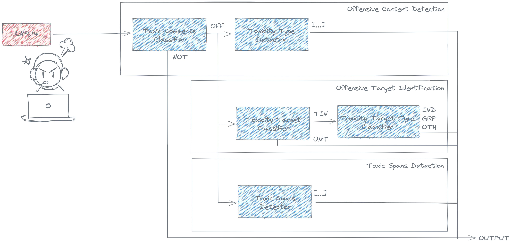

ToChiquinho is a tool that helps you to detect toxicity in text in Brazilian Portuguese.

It's based on several models trained on [OLID-BR](https://dougtrajano.github.io/olid-br/) dataset.

ToChiquinho provides several methods to detect toxicity in text such as:

- **Toxic Comment Classification**: Detects if the text is toxic or not.
- **Toxicity Type Detection**: Detects more than 10 types of toxicity in text.
- **Toxicity Target Classification**: Detects if the text is targeted or not.
- **Toxicity Target Type Identification**: Identifies the type of toxicity in a text (individual, group, or other).
- **Toxic Spans Detection**: Detects the spans of text that are toxic.

<figure>
  
  <figcaption>ToChiquinho's architecture</figcaption>
</figure>

## Motivation

Today, we are living in a world where the internet is becoming more and more important in our lives.

So, we want to ensure healthy online communication between people. You can expose your opinion, but it should be respectful to others.
