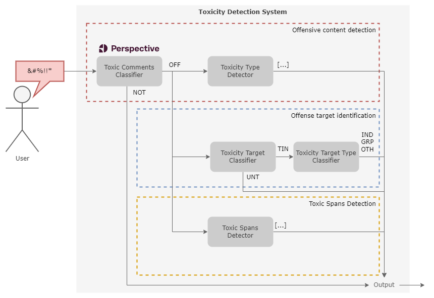

ToChiquinho é uma ferramenta para detectar toxidade em texto em Português do Brasil. Ela é baseada em vários modelos treinados no conjunto de dados [OLID-BR](https://dougtrajano.github.io/olid-br/).

ToChiquinho fornece vários métodos para detectar toxidade em texto como:

- **Toxicity Type Detection**: Detecta o tipo de toxidade no texto.
- **Toxicity Target Classification**: Detecta se o texto é direcionado ou não.
- **Toxicity Target Type Identification**: Identifica o tipo de alvo no texto (individual, grupo, ou outro).
- **Toxic Spans Detection**: Detecta as áreas de toxidade no texto.

## Arquitetura

<figure>
  
  <figcaption>Arquitetura do ToChiquinho</figcaption>
</figure>

## Motivação

Hoje em dia, vivemos em um mundo onde o internet se torna mais e mais importante para nossas vidas.

Então, queremos garantir que a comunicação online seja saudável. Você pode expor sua opinião, mas deve ser respeitoso com outras pessoas.
